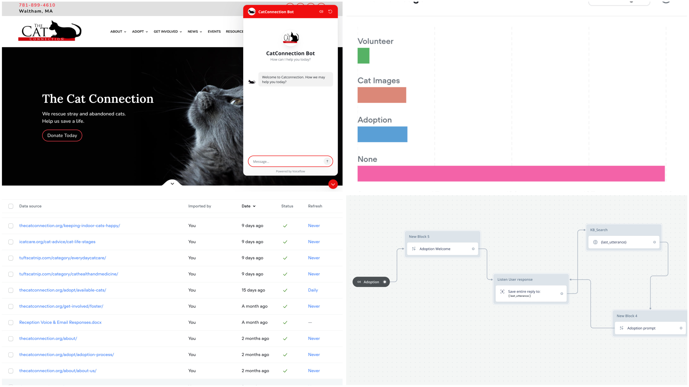

# AI for Good: Northeastern Students Develop CatBot to Boost Special Needs Cat Adoptions

In a powerful demonstration of how artificial intelligence can create positive social impact, a team of Northeastern University students has developed CatBot, an AI-powered chatbot now live on The Cat Connection’s website. Designed to help a Boston-based cat rescue place senior and special needs cats in loving homes, CatBot is more than a technical achievement—it’s a bridge between compassion and technology. 

[Visit The Cat Connection](https://thecatconnection.org/)

## Bridging Technology and Compassion
The project emerged from the "Digital, Analytics, Technology and Automation Advanced Research Practicum" (MKTG 4606/6606), a course taught by Dr. Kwong Chan and Dr. Debashish Ghose at Northeastern University's D'Amore-McKim School of Business. The student team—Tanvie Sud, Shreyaan Pathak, Laasya Anantha Prasad, Siddharth Dumbre, and Nicholas Brown—applied their data analytics and AI skills to tackle a real-world challenge: the difficulty of finding homes for senior and special needs cats.

"While animal shelters have embraced digital tools for years, special needs cats continue to face longer wait times for adoption," explains Dr. Kwong Chan, Executive Director of the DMSB AI Strategic Hub (DASH). "This project demonstrates how targeted AI applications can address specific social challenges while providing students with meaningful experiential learning."

## Addressing a Genuine Need
The Cat Connection, an all-volunteer 501(c)(3) nonprofit no-kill organization, has officially adopted CatBot as part of their digital adoption strategy. The chatbot addresses critical barriers to special needs cat adoption identified through the team's research:

- **Information gaps**: Many potential adopters lack understanding about the care requirements and joys of adopting senior or special needs cats.
- **Matching challenges**: Finding the right personality fit between cats and adopters.
- **Post-adoption support**: Providing guidance for the critical transition period after adoption.

## How CatBot Helped: Simplifying Processes & Supporting Adopters
CatBot was designed as a 24/7 virtual assistant that not only handles logistical queries but also provides emotional reassurance and personalized support, reducing volunteer workload and increasing adopter confidence.

### Key Solutions Implemented:
- **Automated FAQ Handling**: Frees up human volunteers by addressing common inquiries.
- **Reassurance & Education**: Through conversational tone and myth-busting content, CatBot gently educates users on the joys of adopting senior or special needs cats.
- **Behavioral Support**: Offers tips for post-adoption adjustment, including insights from The Cat Connection's foster network.
- **Volunteer and Foster Onboarding**: Guides users through how to help if they can't adopt—via fostering, donating, or volunteering.

## How CatBot Works
CatBot serves as a 24/7 digital assistant on The Cat Connection's website, providing personalized interactions with potential adopters. Key features include:
- Educational resources about caring for cats with specific conditions
- Personality matching quiz to find compatible cats based on lifestyle and preferences
- Cost transparency including information about medical sponsorships and support programs
- Behavioral guidance for the transition period after adoption
- Volunteer and foster recruitment tools
- Alternative support options for those unable to adopt

 <!-- Replace with actual image name -->

## The Research Foundation
The team's approach was grounded in behavioral economics and consumer decision-making models. By analyzing search trends and adoption behaviors, they created a digital strategy optimized for connecting these special cats with compatible adopters.

Their work reflects the growing importance of digital platforms in pet adoption, with recent ASPCA data showing that over 40% of pet adoptions now begin with online searches.

## Understanding the Client: Pain Points, Process, and Research
At the core of this project was a shared mission: supporting The Cat Connection in increasing adoption rates for cats who are often overlooked—those with medical needs, special care requirements, or advanced age. The student team quickly realized this initiative was not about implementing technology for its own sake. It was about understanding the nonprofit’s daily challenges and designing a solution that addressed real-world frictions.

To begin, the team conducted exploratory interviews with Anne, a representative from The Cat Connection. While the initial assumption centered around visibility and awareness as potential blockers, deeper conversations revealed a more complex landscape of operational pain points:
- Volunteers were spending a large portion of their time answering repetitive questions—many from individuals who ultimately did not proceed with adoption.
- Potential adopters often felt unsure or anxious about the care requirements of cats needing daily medication or long-term treatment.
- The shelter lacked a streamlined, digital-first channel for engaging adopters beyond basic FAQ pages, which left many unanswered questions and unmet needs.

## Learning Beyond the Classroom
For the student developers, the project provided invaluable experience in applying AI to solve real-world problems while creating genuine social impact.

"This wasn't just an academic exercise," explains Nicholas Brown, another student team member. "We were building something that would directly help these cats find loving homes. That added a layer of meaning and purpose to our technical work."

## Compassion Can Be Coded
CatBot proves that AI doesn’t have to be sterile or impersonal. When thoughtfully designed, it can clear the path for compassion, giving volunteers more time, adopters more confidence, and cats the second chances they deserve.

---

### Try CatBot
Experience the chatbot firsthand on [The Cat Connection’s website](https://thecatconnection.org/). Whether you're looking to adopt, volunteer, or simply learn more, CatBot is there to guide your journey with empathy and warmth.

<!--  Replace with actual image name -->

## About DASH
The D'Amore-McKim School of Business AI Strategic Hub (DASH) focuses on developing innovative applications of artificial intelligence to address business and social challenges. Through research, education, and experiential learning opportunities, DASH prepares students to become ethical and effective leaders in the rapidly evolving landscape of AI-driven business.

[The Cat Connection](https://thecatconnection.org/)
