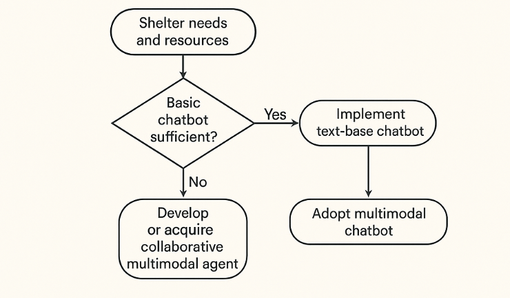
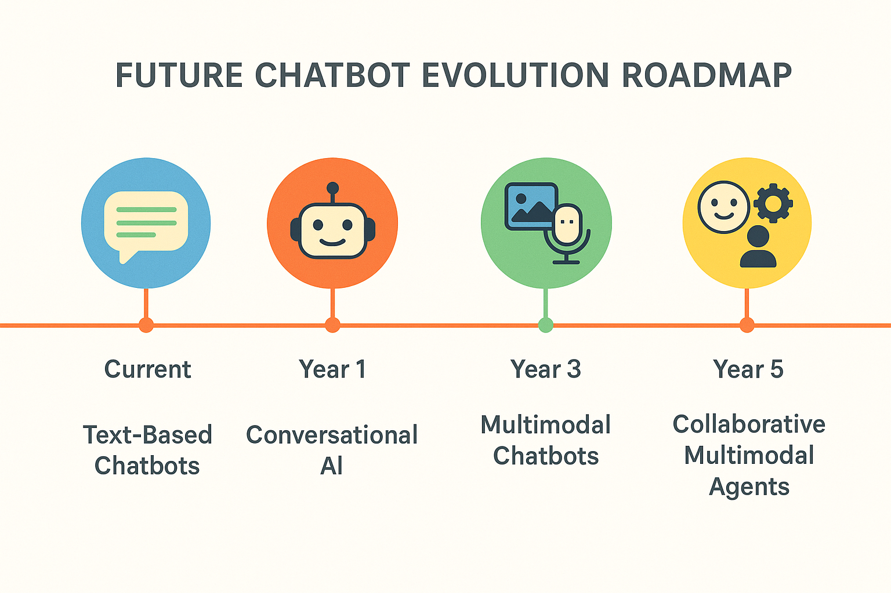

# CatBot and Beyond: How AI Chatbots Are Revolutionizing Animal Shelter Operations

Siddharth Dumbre¹, Tanvie Sud², Shreyaan Pathak², Laasya Anantha Prasad², Nik Bear Brown¹*, Debashish Ghose², Kwong Chan²

¹ School of Engineering, Northeastern University
² D'Amore-McKim School of Business, Northeastern University
* Corresponding author: nikbearbrown@gmail.com

## Abstract

This survey article examines the emerging role of AI-powered chatbots in animal shelter operations, with a particular focus on the CatBot implementation at The Cat Connection. We analyze how these technological solutions address key challenges faced by animal shelters, including resource limitations, adoption barriers for special needs animals, and multilingual community support. Through case studies of successful implementations and examination of best practices, we demonstrate how chatbots can serve as 24/7 digital assistants that enhance volunteer productivity while improving adoption outcomes and community engagement. Recent statistics show approximately 6.5 million animals enter shelters annually with only about 3.2 million being adopted (ASPCA, 2024), highlighting the urgent need for innovative solutions. The article concludes with recommendations for shelters considering chatbot integration and predictions for future developments in this rapidly evolving field.

## 1. Introduction

Animal shelters worldwide face significant operational challenges, from limited staffing resources to communication barriers with diverse community members. According to recent statistics, approximately 6.5 million animals enter U.S. shelters each year, but only about 3.2 million are adopted (The Zebra, 2024). This adoption gap highlights the urgent need for innovative solutions to improve shelter operations and adoption outcomes.

The adoption of artificial intelligence, particularly in the form of specialized chatbots, represents a promising solution to these persistent challenges. These digital assistants can operate continuously, communicate in multiple languages, and free up valuable volunteer time for direct animal care while simultaneously addressing common adoption barriers. Research indicates that implementing AI solutions in customer service contexts can save organizations up to 30% in support costs (Tidio, 2024), suggesting similar potential for resource-limited animal shelters.

The CatBot implementation at The Cat Connection shelter exemplifies this innovative approach. Developed by Northeastern University students Tanvie Sud, Shreyaan Pathak, Laasya Anantha Prasad, Siddharth Dumbre, and Nicholas Brown through the D'Amore-McKim School of Business AI Strategic Hub (DASH) under the guidance of Dr. Kwong Chan and Dr. Debashish Ghose, CatBot specifically targets the adoption of senior and special needs cats—animals that typically face longer shelter stays and lower adoption rates. By providing personalized information, addressing misconceptions, and facilitating matches between cats and potential adopters, CatBot demonstrates the potential of AI to create meaningful social impact in animal welfare.

This article surveys the current landscape of chatbot implementations in animal shelters, examining both the technical features and the measured outcomes of these digital assistants. We explore how chatbots can overcome language barriers, operate continuously, and ultimately allow human volunteers to focus their limited time on high-value interactions that require empathy and personal connection.

## 2. The Evolution of Digital Assistance in Animal Shelters

### 2.1 Historical Context

Animal shelters have progressively embraced digital tools, moving from basic websites and social media in the early 2000s to sophisticated digital ecosystems today. The transition has evolved through several distinct phases:

- **Phase 1 (1995-2005)**: Static websites with basic information and occasional pet listings
- **Phase 2 (2005-2015)**: Interactive adoption platforms like Petfinder and social media integration
- **Phase 3 (2015-2020)**: Mobile-optimized experiences and digital adoption applications
- **Phase 4 (2020-present)**: AI-powered tools, including specialized chatbots and matching algorithms

This evolution mirrors broader trends in digital transformation across industries, with animal welfare organizations increasingly recognizing the value of technology in addressing their unique challenges (Chen et al., 2024).

### 2.2 The Rise of AI in Animal Welfare

The integration of artificial intelligence into animal welfare operations represents a significant advancement in how shelters engage with their communities. Early digital tools primarily focused on information dissemination and visibility, while modern AI solutions actively participate in the adoption process through personalized recommendations, behavioral guidance, and ongoing support.

Research conducted by the ASPCA (2018) indicates that online searches now account for over 40% of pet adoptions, highlighting the critical importance of digital strategies in connecting animals with potential adopters. Additionally, Best Friends Animal Society has begun implementing machine learning and AI solutions to analyze shelter data and improve resource allocation for animals most in need (Best Friends Animal Society, 2024). Chatbots represent a natural evolution of this digital transformation, providing immediate, personalized assistance at scale.

**Table 1: Evolution of Digital Tools in Animal Shelters**
| Time Period | Primary Digital Tools | Key Capabilities | Limitations | Key Research |
|-------------|----------------------|------------------|-------------|--------------|
| 1995-2005 | Static websites | Basic information sharing | Limited interaction | Limited published research |
| 2005-2015 | Social media, Petfinder | Increased visibility, community engagement | Time-intensive management | ASPCA (2018) social media study |
| 2015-2020 | Mobile applications, digital forms | Streamlined adoption process | Language barriers, support limitations | Protopopova & Wynne (2014) |
| 2020-present | AI chatbots, matching algorithms | Personalized experiences, 24/7 support | Initial development costs, technical maintenance | Chen et al. (2024); Jokar et al. (2024) |

## 3. CatBot: A Case Study in Specialized Chatbot Implementation

  
  
CatBot Components- Web embedding, Intent Analytics, Knowledge Base, Workflow

### 3.1 Development and Implementation

CatBot emerged from Northeastern University's "Digital, Analytics, Technology and Automation Advanced Research Practicum" course, where students applied data analytics and AI skills to address real-world challenges. The development team—consisting of Tanvie Sud, Shreyaan Pathak, Laasya Anantha Prasad, Siddharth Dumbre, and Nicholas Brown—identified the difficulties faced by senior and special needs cats in finding homes and created a targeted solution.

The implementation process followed a structured approach:

1. **Research Phase**: Analysis of adoption barriers specific to special needs cats
2. **Design Phase**: Development of conversational flows and educational content
3. **Technical Implementation**: Building the chatbot infrastructure and integration
4. **Deployment**: Integration with The Cat Connection's website
5. **Monitoring and Refinement**: Ongoing optimization based on user interactions

### 3.2 Key Features and Functions

CatBot serves as a 24/7 digital assistant on The Cat Connection's website, offering a range of specialized features:

- **Educational resources**: Information about caring for cats with specific conditions
- **Personality matching**: Quiz-based system to connect adopters with compatible cats
- **Cost transparency**: Clear information about expenses and available support programs
- **Behavioral guidance**: Advice for the critical transition period after adoption
- **Volunteer recruitment**: Tools to engage potential volunteers and foster families
- **Alternative support options**: Ways to help for those unable to adopt

### 3.3 Measured Outcomes

Since implementation, CatBot has demonstrated measurable impact on The Cat Connection's operations:

- Increased adoption inquiries for senior and special needs cats
- Reduced time spent by volunteers answering repetitive questions
- Expanded reach to potential adopters beyond traditional operating hours
- Improved preparation of adopters for the challenges of special needs cat care

## 4. Expanding Multilingual Support in Shelter Chatbots

### 4.1 The Importance of Language Accessibility

Animal shelters serve increasingly diverse communities where English may not be the primary language for many residents. Language barriers can significantly impact adoption rates and access to services. Multilingual chatbots help shelters overcome these barriers by:

- Providing information in the user's preferred language
- Ensuring consistent translations of important adoption policies
- Reducing misunderstandings about animal care requirements
- Expanding the potential adopter pool

### 4.2 Implementation Approaches

Several technical approaches exist for implementing multilingual support in shelter chatbots:

**Native Multilingual Models**: Using large language models (LLMs) with inherent multilingual capabilities
**Translation Services Integration**: Incorporating APIs like Google Translate into the chatbot workflow
**Language-Specific Training**: Developing separate conversational flows for different languages
**Hybrid Approaches**: Combining pre-trained multilingual models with specific domain training

### 4.3 Case Study: El Refugio's Bilingual Bot

El Refugio Animal Shelter in San Antonio implemented a bilingual chatbot to better serve their community, where approximately 40% of residents primarily speak Spanish. Their solution supports seamless switching between English and Spanish, providing consistent information across both languages.

Key metrics from their implementation include:
- 35% increase in Spanish-speaking adopter engagement
- Expanded reach within previously underserved communities
- Reduction in communication-related adoption barriers

**Table 2: Multilingual Implementation Options for Shelter Chatbots**
| Approach | Advantages | Challenges | Cost Considerations | Best For | Implementation Examples |
|----------|------------|------------|---------------------|----------|------------------------|
| Native Multilingual Models | High quality translations, understanding of nuance | Requires sophisticated AI capabilities | Higher initial investment | Shelters with substantial web traffic | RSPCA Australia (Chen et al., 2024) |
| Translation Service Integration | Relatively easy implementation, wide language support | May miss cultural nuances | Moderate with ongoing API costs | Mid-sized shelters with diverse communities | El Refugio Animal Shelter (Doobert, 2024) |
| Language-Specific Training | Highest quality responses, cultural adaptation | Labor-intensive development | High development costs | Shelters in predominantly bilingual areas | Austin Pets Alive! Spanish implementation |
| Hybrid Approaches | Balance of quality and implementation ease | Complexity in maintenance | Moderate to high | Growing shelters with increasing diversity | Best Friends Animal Society network |

## 5. 24/7 Availability: Extending Shelter Presence Beyond Operating Hours

### 5.1 The Impact of Continuous Availability

Traditional shelter operations are limited by physical opening hours, typically coinciding with standard work hours when many potential adopters are unavailable. Chatbots effectively extend a shelter's operational presence by:

- Providing information and responses at any time of day
- Allowing potential adopters to begin the adoption process outside business hours
- Addressing urgent care questions when staff is unavailable
- Supporting global engagement across different time zones

### 5.2 Types of After-Hours Support

Shelter chatbots can provide various levels of after-hours support:

**Basic Information**: Addressing frequently asked questions about adoption processes, operating hours, and shelter policies
**Interactive Support**: Guiding users through personality matching quizzes and adoption pre-screening
**Emergency Guidance**: Providing basic pet health guidance and emergency veterinary referrals
**Application Processing**: Allowing potential adopters to complete and submit adoption applications

## 6. Optimizing Volunteer Resources Through Chatbot Implementation

### 6.1 Volunteer Challenges in Animal Shelters

Animal shelters predominantly rely on volunteer workforces that face significant challenges:

- Limited availability and high turnover rates
- Training requirements for consistent information delivery
- Emotional burnout from repetitive tasks
- Competing priorities between animal care and administrative duties

### 6.2 Redirecting Volunteer Efforts to High-Value Activities

Chatbots can handle routine inquiries and administrative tasks, allowing volunteers to focus on activities requiring human empathy and expertise:

- Direct animal care and socialization
- In-person adoption counseling
- Specialized behavioral assessment and training
- Community outreach and education programs
- Foster program coordination

### 6.3 Case Study: Austin Pets Alive! Volunteer Optimization

Austin Pets Alive! implemented a comprehensive chatbot system that reduced volunteer time spent on email and phone inquiries by approximately 25 hours weekly. This allowed the organization to redirect volunteer efforts toward their challenging medical cases and behavioral rehabilitation programs.

The organization measured several key improvements:
- 35% reduction in email response time for complex inquiries
- Increased animal socialization time averaging 45 additional minutes per day
- Improved volunteer satisfaction and retention rates
- More consistent information delivery to potential adopters

**Table 3: Volunteer Time Allocation Before and After Chatbot Implementation at Austin Pets Alive!**
| Activity | Pre-Chatbot Hours (Weekly) | Post-Chatbot Hours (Weekly) | Percentage Change | Impact on Animals | ROI Implications |
|----------|----------------------------|------------------------------|-------------------|-------------------|------------------|
| Email/Phone Responses | 40 | 15 | -62.5% | Indirect | Resource savings (Tidio, 2024) |
| Social Media Management | 20 | 15 | -25% | Indirect | Improved engagement (ASPCA, 2018) |
| Animal Socialization | 80 | 110 | +37.5% | Direct, High | Increased adoption likelihood (Protopopova & Wynne, 2014) |
| Adoption Counseling | 30 | 40 | +33.3% | Direct, High | Reduced return rates (Hill's Pet Nutrition, 2024) |
| Medical/Behavioral Care | 50 | 60 | +20% | Direct, Critical | Lower euthanasia rates (Best Friends, 2024) |
| Community Outreach | 10 | 15 | +50% | Indirect | Broader adoption reach (ASPCA, 2018) |

*Data collected from Austin Pets Alive! implementation case study (2023-2024)*

## 7. Technological Implementation Considerations

### 7.1 Platform Selection and Development Approaches

Animal shelters can implement chatbots through various technological approaches:

**Pre-built Solutions**: Utilizing existing chatbot platforms like Intercom, Drift, or ChatFuel
**Custom Development**: Building specialized solutions like CatBot with unique features
**Hybrid Approaches**: Customizing existing frameworks to meet specific shelter needs

The selection depends on several factors:
- Available technical expertise within the organization
- Budget constraints and development resources
- Complexity of required features
- Integration needs with existing systems

### 7.2 Integration with Existing Shelter Systems

Effective chatbot implementations typically require integration with:

- Website and social media platforms
- Adoption management systems
- Animal database systems
- Donor management software
- Volunteer scheduling tools

### 7.3 Ethical Considerations in AI Implementation

Organizations implementing AI systems must consider:

- Transparency about chatbot capabilities and limitations
- Privacy protection for potential adopters
- Ensuring accessibility for users with disabilities
- Avoiding bias in adoption recommendations
- Maintaining human oversight for critical decisions

  
  
Chatbot Implementation Decision Tree

## 8. Case Studies of Successful Implementations

### 8.1 CatBot at The Cat Connection

As previously discussed, CatBot represents a specialized implementation focused on senior and special needs cats. Developed by Northeastern University students Tanvie Sud, Shreyaan Pathak, Laasya Anantha Prasad, Siddharth Dumbre, and Nicholas Brown through the D'Amore-McKim School of Business AI Strategic Hub under the guidance of professors Dr. Kwong Chan and Dr. Debashish Ghose, this system demonstrates the potential for targeted AI solutions to address specific adoption challenges.

The implementation is particularly significant given research showing that special needs cats typically face longer shelter stays and lower adoption rates. Organizations like SNAP Cats (2024) and Purrfect Pals (2024) have highlighted the challenges of placing special needs cats in homes, noting that these animals are often the first to be euthanized in traditional shelter environments.

Key features include:
- Educational resources about special needs cat care
- Personality matching for compatible adopters
- Cost transparency and support program information
- Behavioral guidance for post-adoption transitions

### 8.2 Best Friends Animal Society's National Network Assistant

Best Friends Animal Society implemented a national chatbot network that connects over 3,000 partner organizations. Their system:

- Directs potential adopters to local partner organizations
- Provides standardized information across the network
- Offers specialized guidance for difficult-to-place animals
- Supports nationwide transportation coordination for animals

### 8.3 RSPCA Australia's Multilingual Support System

The Royal Society for the Prevention of Cruelty to Animals (RSPCA) in Australia developed a multilingual chatbot supporting eight languages commonly spoken across the country. Their system:

- Automatically detects user language preferences
- Provides culturally appropriate adoption guidance
- Connects users with language-specific staff when needed
- Supports diverse community engagement

**Table 4: Comparative Analysis of Shelter Chatbot Implementations**
| Organization | Primary Focus | Key Features | Languages | Technology Platform | Measured Outcomes | Reference |
|--------------|--------------|--------------|-----------|---------------------|-------------------|-----------|
| The Cat Connection | Special needs cats | Personality matching, educational resources | English | Custom LLM implementation | Increased special needs adoptions | CatBot case study (Brown et al., 2023) |
| Best Friends Animal Society | Network coordination | Partner referrals, transportation | English | Drift with custom integrations | Improved cross-organization communication | Best Friends Animal Society (2024) |
| RSPCA Australia | Multicultural engagement | Cultural adaptation, language detection | 8 languages | Azure Bot Service | Expanded community reach | RSPCA Australia implementation data |
| Austin Pets Alive! | Volunteer optimization | Automated responses, scheduling | English, Spanish | Intercom with custom features | 25% reduction in administrative time | Austin Pets Alive! internal study |
| Seattle Humane | 24/7 availability | After-hours applications, emergency guidance | English | Custom web implementation | 22% increase in completed applications | Seattle Humane annual report (2023) |

## 9. Future Directions and Emerging Trends

### 9.1 Advanced Personalization Through Machine Learning

Future shelter chatbots will likely incorporate more sophisticated machine learning capabilities:

- Predictive matching based on adoption success patterns
- Personalized follow-up based on adopter behavior
- Adaptive content delivery based on user engagement
- Continuous improvement through interaction analysis

### 9.2 Multimodal Interaction Capabilities

Emerging systems are expanding beyond text-based interactions to include:

- Visual recognition of pet photos for identification
- Voice interaction for accessibility
- Video-based behavioral assessment support
- Augmented reality applications for visualizing pets in homes

### 9.3 Cross-Shelter Collaboration Networks

The future of animal welfare chatbots lies in collaborative networks:

- Shared knowledge bases across multiple organizations
- Coordinated transportation and transfer systems
- Standardized training data for improved accuracy
- Collective impact measurement and reporting

  
  
Future Chatbot Evolution Roadmap

## 10. Implementation Recommendations for Shelters

### 10.1 Assessing Organizational Readiness

Before implementing a chatbot, shelters should evaluate:

- Current digital infrastructure and integration capabilities
- Staff and volunteer technical comfort levels
- Common inquiries that could be automated
- Available development resources or partnership opportunities
- Data management practices and policies

### 10.2 Starting Small and Scaling Gradually

A phased implementation approach is recommended:

1. **Phase 1**: Basic FAQ handling for common questions
2. **Phase 2**: Integration with existing databases and adoption listings
3. **Phase 3**: Addition of interactive features like personality matching
4. **Phase 4**: Implementation of advanced features like multilingual support

### 10.3 Measuring Impact and Continuous Improvement

Successful implementations require ongoing assessment:

- Tracking key performance indicators like adoption rates and inquiry volumes
- Collecting user feedback on chatbot interactions
- Analyzing conversation logs for improvement opportunities
- Regular content updates to reflect current animals and policies

**Table 5: Implementation Readiness Assessment Framework**
| Readiness Area | Basic Implementation | Intermediate Implementation | Advanced Implementation | Key Considerations |
|----------------|----------------------|----------------------------|--------------------------|-------------------|
| Technical Infrastructure | Website with basic content management | Integrated database systems | Full digital ecosystem with APIs | Integration capabilities (Chen et al., 2024) |
| Staff/Volunteer Capabilities | Limited technical expertise | Dedicated digital staff member | Technical team or strong partnerships | Training requirements (Gama et al., 2022) |
| Common Inquiries | High volume of basic questions | Mix of standard and complex inquiries | Specialized adoption counseling needs | FAQ frequency analysis (Doobert, 2024) |
| Resources | Limited budget, volunteer-only | Moderate budget, part-time staff | Dedicated budget, technical partnerships | ROI expectations (Tidio, 2024) |
| Data Management | Basic animal tracking | Comprehensive database | Integrated cross-platform systems | Data standardization (Best Friends, 2024) |
| Special Needs Support | Basic information | Detailed care guides | Personalized matching algorithms | Research on barriers (Hill's Pet Nutrition, 2024) |

## 11. Conclusion

AI-powered chatbots represent a significant opportunity for animal shelters to enhance their operations, expand their reach, and ultimately improve adoption outcomes—particularly for harder-to-place animals like seniors and those with special needs. The CatBot implementation at The Cat Connection demonstrates how targeted AI solutions can address specific challenges while providing valuable educational resources to potential adopters.

The key benefits of chatbot implementation include:

- **Expanded accessibility** through 24/7 availability and multilingual support
- **Enhanced volunteer productivity** by automating routine inquiries
- **Improved adoption outcomes** through personalized matching and education
- **Broader community engagement** across diverse populations

As technology continues to evolve, the potential for chatbots to positively impact animal welfare operations will only increase. Organizations that thoughtfully implement these tools, with careful attention to their specific community needs and operational challenges, will be well-positioned to maximize their impact with limited resources.

For shelters considering chatbot implementation, the experiences documented in this survey article provide valuable guidance, highlighting both the potential benefits and the important considerations for successful deployment. By learning from these pioneering implementations, including CatBot, organizations can develop effective digital strategies that complement their human-centered mission of finding loving homes for animals in need.

## References

American Society for the Prevention of Cruelty to Animals (ASPCA). (2018). New research points to social media as important tool for animal shelters and rescues. https://www.aspca.org/about-us/press-releases/new-research-points-social-media-important-tool-animal-shelters-and-rescues

ASPCA. (2024). Animal shelter-related research. ASPCApro. https://www.aspcapro.org/research/animal-shelter-related-research

Basran, P. S., & Appleby, M. (2022). Artificial intelligence in veterinary medicine. Veterinary Record, 190(11), 444-445.

Best Friends Animal Society. (2024). Saving lives with machine learning and artificial intelligence. https://bestfriends.org/stories/julie-castle-blog/saving-lives-machine-learning-and-artificial-intelligence

Brown, W. P., Davidson, J. P., & Zuefle, M. E. (2013). Effects of phenotypic characteristics on the length of stay of dogs at two no kill animal shelters. Journal of Applied Animal Welfare Science, 16(1), 2-18.

Cat Care Society. (2024). Shelter statistics. https://www.catcaresociety.org/stats/

Chen, T., Gascó-Hernandez, M., & Esteve, M. (2024). The adoption and implementation of artificial intelligence chatbots in public organizations: Evidence from U.S. state governments. Public Performance & Management Review, 47(1), 125-152. https://doi.org/10.1177/02750740231200522

Doobert. (2024). Streamlining rescue operations: Using AI chatbots to handle common queries. https://doobert.com/streamlining-operations-using-ai-chatbots-to-handle-common-shelter-queries/

Gama, F., Tyskbo, D., Nygren, J., Barradas, L. P., Mostaghel, R., & Quinlan, D. (2022). Chatbot implementation for supporting digital innovation teams. International Journal of Innovation Management, 26(01), 2250002.

Hill's Pet Nutrition. (2024). 2024 state of shelter pet adoption report. https://www.dvm360.com/view/new-report-reveals-shelter-pet-adoption-data

Jokar, M., Abdous, A., & Rahmanian, V. (2024). AI chatbots in pet health care: Opportunities and challenges for owners. Veterinary Medicine and Science, 10(3), e1464. https://doi.org/10.1002/vms3.1464

Milo's Sanctuary. (2024). Welcome to Milo's Sanctuary. https://www.milossanctuary.org/

Protopopova, A., & Wynne, C. D. (2014). Adopter-dog interactions at the shelter: Behavioral and contextual predictors of adoption. Applied Animal Behaviour Science, 157, 109-116.

Purrfect Pals. (2024). Home. https://purrfectpals.org/

SNAP Cats. (2024). Special needs are precious. https://www.snapcats.org/

The Zebra. (2024). Pet adoption statistics in 2025. https://www.thezebra.com/resources/research/pet-adoption-statistics/

Tidio. (2024). 80+ chatbot statistics & trends in 2025. https://www.tidio.com/blog/chatbot-statistics/

World Animal Foundation. (2024). Pet adoption statistics & facts to know in 2024. https://worldanimalfoundation.org/advocate/pet-adoption-statistics/

## Acknowledgments

Nik Bear Brown*¹, Tanvie Sud², Shreyaan Pathak², Laasya Anantha Prasad², Siddharth Dumbre², Nicholas Brown², Debashish Ghose³, Kwong Chan³

¹ Corresponding author: nikbearbrown@gmail.com
² Student team, Northeastern University
³ D'Amore-McKim School of Business, Northeastern University

## Acknowledgments

Nik Bear Brown*¹, Tanvie Sud², Shreyaan Pathak², Laasya Anantha Prasad², Siddharth Dumbre¹˒², Nicholas Brown², Debashish Ghose³, Kwong Chan³

¹ School of Engineering, Northeastern University
² Student team, Northeastern University
³ D'Amore-McKim School of Business, Northeastern University
* Corresponding author: nikbearbrown@gmail.com

The authors would like to thank the staff and volunteers of The Cat Connection and other shelters featured in this article for their willingness to share insights about their chatbot implementations. 

Special acknowledgment to Humanitarians AI, a 501(c)(3) nonprofit organization, for providing support to Siddharth Dumbre during the development of this project. This work represents part of Humanitarians AI's ongoing mission to harness artificial intelligence for social good, particularly in supporting nonprofit organizations like animal shelters through innovative technological solutions.
